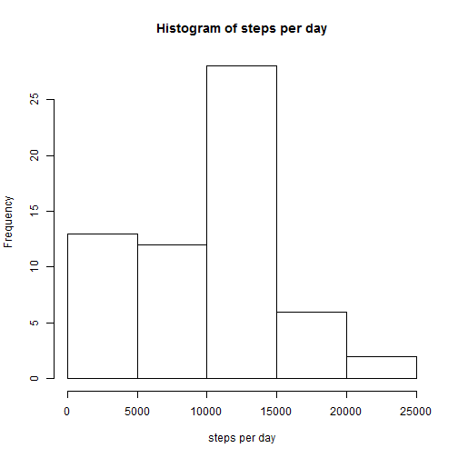
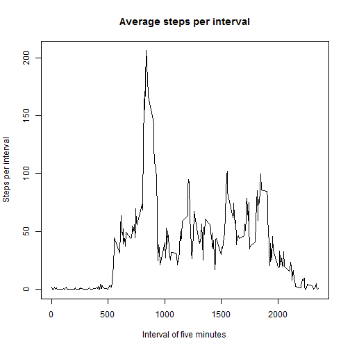
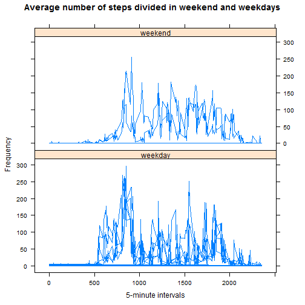

#### Loading and preprocessing the data

Show any code that is needed to

1. Load the data (i.e. read.csv()).


```r
data <- read.csv(file= "activity.csv", header = TRUE, sep=",")
```

2. Process/transform the data (if necessary) into a format suitable for your analysis.


```r
data$date2 <- as.Date(data$date, digits = 10)
```
I transformed the date, because the weekdays function wouldn't work without it...

#### What is the mean total number of steps taken per day?

For this part of the assignment, you can ignore the missing values in the dataset.

1. Calculate the total number of steps taken per day.


```r
steps_day <- rowsum(data$steps,data$date, na.rm=TRUE)
```

2. If you do not understand the difference between a histogram and a barplot, research the difference between them. Make a histogram of the total number of steps each day.


```r
hist(steps_day, main = "Histogram of steps per day", xlab = "steps per day")
```

 

3. Calculate and report the mean and median of the total number of steps taken per day.


```r
mean(steps_day)
```

```
## [1] 9354.23
```

```r
median(steps_day)
```

```
## [1] 10395
```


#### What is the average daily pattern?

1. Make a time series plot (i.e. type="l") of the 5-minute interval (x-axis) and the average number of steps taken, averaged acress all days (y-axis).


```r
steps_interval <- aggregate(data$steps, list(data$interval), mean, na.rm=TRUE)
plot(steps_interval$Group.1, steps_interval$x, type="l", main="Average steps per interval", xlab = "Interval of five minutes", ylab = "Steps per interval")
```

 

2. Which 5-minute interval, on average across all the days in the dataset, contains the maximum number of steps?


```r
steps_interval[steps_interval$x==max(steps_interval$x),]
```

```
##     Group.1        x
## 104     835 206.1698
```
So, the maximum number of steps on average are taken in the 5-minute interval from 8:35 to 8:40.

#### Imputing missing values

Note that there are a number of days/intervals where there are missing values (coded as NA). The presence of missing days may introduce bias into some calculations or summaries of the data.

1. Calculate and report the total number of missing values in the dataset (i.e. the total number of rows with NAs)


```r
missing <- data[data$steps==NA,]
nrow(missing)
```

```
## [1] 17568
```
So the number of missing values in the dataset is 17568

2. Devise a strategy for filling in all of the missing values in the dataset. The strategy does not need to be sophisticated. For example, you could use the mean/median for that day, or the mean for that 5-minute interval etc.


My strategy is to use the mean of the 5-minute intervals, since I already have that data.

3. Create a new dataset that is equal to the original dataset but with the missing data filled in.


```r
data2 <- data
index_na <- which(is.na(data2$steps))
for(i in index_na){
  data2$steps[i] <- round(with(steps_interval, x[Group.1 == data2$interval[i]]))
}
```

4. Make a histogram of the total number of steps taken each date and Calculate and report the mean and median total number of steps taken per day. Do these values differ from the estimates from the first part of the assignment? What is the impact of imputting missing data on the estimates of the total daily number of steps?


```r
steps_day2 <- rowsum(data2$steps,data2$date)
hist(steps_day2, main = "Histogram of steps per day with imputting missing data", xlab = "steps per day")
```

 


```r
mean(steps_day2)
```

```
## [1] 10765.64
```

```r
median(steps_day2)
```

```
## [1] 10762
```
The difference with imputting missing data is that the values of the mean and median got closer together compared to just removing the missing values in the calculations at the beginning of this assignment.

#### Are there differences in activity patterns between weekdays and weekends?

For this part the weekdays() function may be of some help here. Use the dataset with the filled-in missing for this part.

1. Create a new factor variable in the dataset with two levels - "weekday" and "weekend" indicating whether a given date is a weekday or weekend day.


```r
data2$day <- weekdays(data2$date2, abbreviate=FALSE)
data2$weekday <- ifelse(data2$day=="zaterdag" | data2$day=="zondag", "weekend", "weekday")
```

2. Make a panel plot containing a time series plot (i.e. type="l") of the 5-minute interval (x-axis) and the average number of steps taken, averaged across all weekday days or weekend days (y-axis). 


```r
steps_interval2 <- aggregate(data2$steps, list(data2$interval, data2$day, data2$weekday), mean)

library(lattice)
xyplot(x ~ Group.1|Group.3, data=steps_interval2, type="l",layout=c(1,2), main="Average number of steps divided in weekend and weekdays", xlab="5-minute intervals", ylab="Frequency")
```

 


